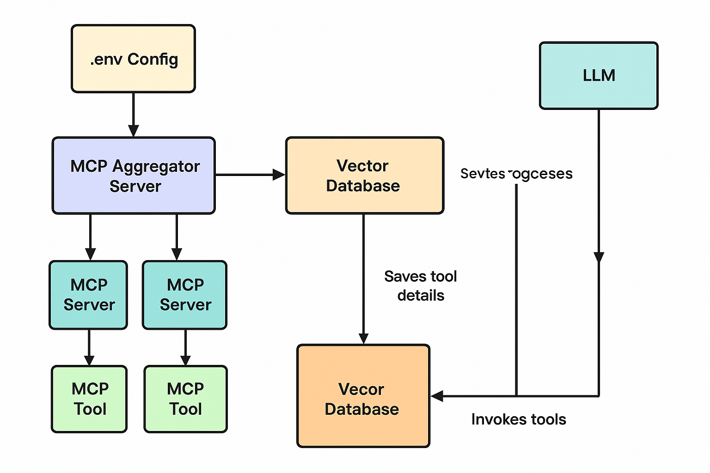

# 🧸 mcp aggregatr

hiii!! this is a silly lil server that grabs tools from other mcp servers like gotta-catch-em-all 🔧🐸
it keeps all the tool stuff in pinecone (it's like a brain made of 🧊🌲)
then u can ask it stuff, and it finds the best tool to help u and runs it!! zoom 💨

---

## 🧃 how to play with it

1. make a `.env` file like this:

```
MCP_SERVERS=http://localhost:8081,http://localhost:8082
PINECONE_API_KEY=your-pinecone-key
PINECONE_ENVIRONMENT=ur-env-name
PINECONE_INDEX_NAME=mcp-tools
```

2. install all the yummy thingies with uv 🧪✨

```bash
uv venv .venv
source .venv/bin/activate
uv pip install -r pyproject.toml
```

(if `uv` not found, run: `pip install uv` first 😅)

---

3. run run run!!

```bash
uvicorn aggregator_server:app --port 8090
```

---

## 📞 ask it qestions

```bash
curl "http://localhost:8090/tools/mcp_aggregator?search=do u kno the weather in delhi?"
```

it will open the pinecone brain 🧠🌲 and find the best tool to help u 🤓

---

## 🤖 robot can ask too!!

robot (llm) can call it like this:

```json
{
  "tool": "mcp_aggregator",
  "args": {
    "search": "say a funny joke lol"
  }
}
```

---


okie dokie that’s it!! 💻🌈🐣
made by viraj da super coder 🧙‍♂️💚


